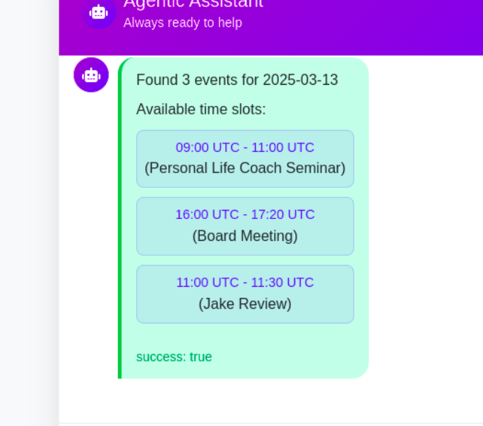

# CrewAI Calendar Bot — Agent-Based Text Chat Scheduler

A smart, **CrewAI-powered chatbot** that helps you manage your Google Calendar using natural language text commands. This assistant is built around a **single agent** that performs **multiple scheduling tasks** using various tools — all wrapped in a Flask backend with a lightweight PHP frontend.

---

## 🧠 Core Concept

Instead of multiple agents, this system features **one powerful agent** designed to handle complex scheduling workflows. The agent uses **CrewAI's task-tool structure**, where each task (like adding events, checking free time, or setting reminders) is delegated to specialized tools under the hood.

---




## 🔑 Key Features

- 🧠 One CrewAI agent orchestrating multiple calendar tasks
- 📅 Google Calendar integration
- 💬 Gemini API for natural language command understanding
- 🛠️ Tool-based task execution (event creation, availability check, reminders, etc.)
- 🌐 Flask backend for API endpoints
- 💻 PHP frontend for user interaction
- 🌍 Time zone support
- 🔔 Built-in reminder logic

---

## 🧩 System Architecture

```
┌────────────────────┐       ┌──────────────┐
│  PHP Frontend UI   │◄────► │ Flask API    │
└────────────────────┘       └─────┬────────┘
                                   │
                        ┌──────────▼────────────┐
                        │    CrewAI Agent       │
                        │ "Calendar Assistant"  │
                        └──────────┬────────────┘
                                   │
       ┌───────────────────────────▼───────────────────────────┐
       │ Tasks:                                                │
       │  - Understand user intent (via Gemini API)            │
       │  - Add new calendar event                             │
       │  - Check availability in a time slot                  │
       │  - Show events (today, week, etc.)                    │
       │  - Set up reminders                                   │
       └───────────────────────────┬───────────────────────────┘
                                   │
                            ┌──────▼──────┐
                            │ Google Cal  │
                            │ API Backend │
                            └─────────────┘
```

---

## 🚀 Setup

### 1. Clone the Repository

```bash
git clone https://github.com/neeldevenshah/crewai-text-calendar-bot.git
cd crewai-calendar-bot
```

---

### 2. Backend (Python, CrewAI, Flask)

#### Environment Setup

```bash
python -m venv venv
source venv/bin/activate
pip install -r requirements.txt
```

#### `config.json`

```json
{
  "timezone": "Asia/Riyadh",
  "reminder_minutes": 30,
  "default_meeting_duration": 60,
  "gemini_api_key": "your-gemini-api-key"
}
```

#### Google Calendar Setup

- Enable **Google Calendar API** in [Google Cloud Console](https://console.cloud.google.com/)
- Generate OAuth credentials, save as `credentials.json` in project root

---

## 💬 Example Commands

| Command Example                           | Task Handled By Agent Tool |
| ----------------------------------------- | -------------------------- |
| “Add lunch with Sara tomorrow at 1pm”     | `AddEventTool`             |
| “Do I have time free next Monday at 4pm?” | `CheckAvailabilityTool`    |
| “Show me my events for today”             | `ViewEventsTool`           |

---

## 🛠 Tool-Based Design

All functionality is modularized into **tools**:

- `AddEventTool`
- `CheckAvailabilityTool`
- `ViewEventsTool`
- `ParseIntentTool` (powered by Gemini API)

This design allows the single CrewAI agent to flexibly handle a range of scheduling scenarios with minimal coupling.

---

## 📄 License

This project is licensed under the MIT License.
